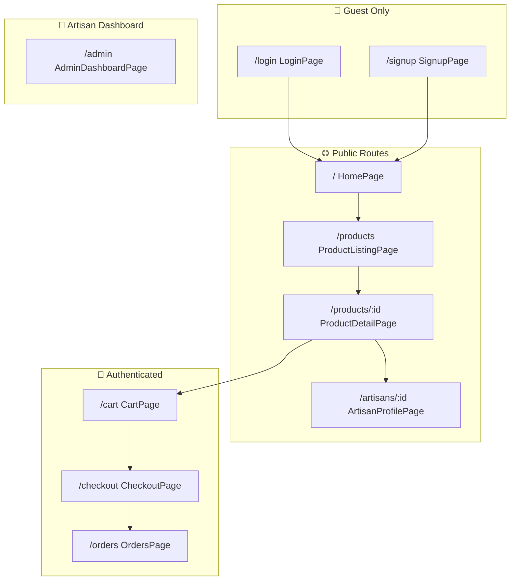

# KARU Marketplace

> A premium handicraft marketplace connecting artisans with conscious buyers. Available all over Bangladesh, not globally.

## Current Status
✅ **Phase E Complete** - Checkout, Orders & Admin Dashboard
✅ **Phase D Complete** - Vercel Deployment & Environment Fix
✅ **Phase C Complete** - User Authentication & Cart
✅ **Phase B Complete** - Homepage Integration
✅ **Phase A Complete** - Page-to-Page Linking Fixed
✅ **Phase 6 Complete** - Convex Backend Integration

### Implementation Log
- [x] **Checkout Flow & Orders**
  - [x] Checkout page with shipping address form
  - [x] Order creation and cart clearing
  - [x] Order confirmation page
  - [x] Order history page with expandable details
  - [x] Status badges (pending/processing/shipped/delivered)
- [x] **Admin Dashboard**
  - [x] Artisan selector for multi-artisan support
  - [x] Overview tab with sales stats
  - [x] Products tab with add/edit/delete
  - [x] Orders tab with status management
- [x] **Vercel Deployment**
  - [x] Configured `VITE_CONVEX_URL` in Vercel for production connectivity
  - [x] Updated `SITE_URL` in Convex for authentication redirects
- [x] React 19 + Vite + TypeScript setup
- [x] Tailwind CSS v3 with custom earth-tone theme
- [x] Google Fonts (Epilogue, Manrope, Noto Serif)
- [x] Header with logo, search, cart/wishlist icons, orders link
- [x] Footer with navigation columns and social links
- [x] Premium Hero section - 2-column layout with 4-image grid
- [x] Trending Now product grid with filter tabs
- [x] Shop by Category cards
- [x] Featured Artisan spotlight
- [x] React Router configuration
- [x] Product Detail Page with responsive gallery
- [x] Product Listing Page with comprehensive filters
- [x] Artisan Profile Page with biography and story
- [x] **Convex Backend Integration**
  - [x] Database schema (products, artisans, categories, users, cart, orders)
  - [x] Real-time queries and mutations
  - [x] Seed data (4 artisans, 12 products, 5 categories)
- [x] **All Pages Connected to Convex**
  - [x] ProductDetailPage, ArtisanProfilePage, TrendingSection
  - [x] FeaturedArtisan, CategorySection
- [x] **User Authentication & Cart**
  - [x] Convex Auth with Password provider
  - [x] HTTP actions enabled for auth
  - [x] JWT environment variables configured
  - [x] Login and Signup pages
  - [x] Cart page with quantity controls
  - [x] Auth-aware Header with cart count
  - [x] Add to Cart functionality

## Quick Start
```bash
npm install
npm run dev          # Start Vite dev server
npx convex dev      # Start Convex backend (in separate terminal)
```
Open http://localhost:5173

## Environment Variables
For production (Vercel), ensure the following are set:
- `VITE_CONVEX_URL`: Your Convex deployment URL (from `npx convex dev` or Convex dashboard).
- `SITE_URL`: (In Convex Dashboard) Your Vercel deployment URL (e.g., `https://karu-bd.vercel.app`).

## Tech Stack
- **Frontend**: React 19, TypeScript, Vite
- **Styling**: Tailwind CSS v3
- **Icons**: Lucide React
- **Routing**: React Router DOM
- **Backend**: Convex (real-time database)
- **Auth**: @convex-dev/auth

## Project Structure
```
src/
├── components/
│   ├── layout/         # Header, Footer, Layout
│   ├── home/           # Homepage sections
│   └── product/        # ProductCard, FilterSidebar, Gallery, Info
├── pages/              # Home, Products, ProductDetail, Artisan, Login, Signup, Cart, Checkout, Orders, Admin
└── router.tsx          # Route definitions
convex/
├── schema.ts           # Database schema + auth tables
├── auth.ts             # Convex Auth configuration
├── users.ts            # User and cart mutations
├── products.ts         # Product queries
├── artisans.ts         # Artisan queries
├── categories.ts       # Category queries
├── orders.ts           # Order mutations and queries
└── admin.ts            # Admin dashboard queries and product CRUD
```

## Routing Architecture

All routes are defined in [`src/router.tsx`](file:///y:/Antigravity%20workspace/Handicraft%20Marketplace/KARU/src/router.tsx) using React Router DOM v6.

### Route Map



### Route Table

| Route | Component | Access Level | Description |
|-------|-----------|--------------|-------------|
| `/` | `HomePage` | Public | Hero, trending products, categories, featured artisan |
| `/products` | `ProductListingPage` | Public | Filterable product grid with category/price/material filters |
| `/products/:id` | `ProductDetailPage` | Public | Product gallery, details, add-to-cart, artisan info |
| `/artisans/:id` | `ArtisanProfilePage` | Public | Artisan biography, story, studio, and product collection |
| `/login` | `LoginPage` | Guest | Email/password authentication |
| `/signup` | `SignupPage` | Guest | New user registration |
| `/cart` | `CartPage` | Authenticated | Shopping cart with quantity controls |
| `/checkout` | `CheckoutPage` | Authenticated | Shipping address form, order placement |
| `/orders` | `OrdersPage` | Authenticated | Order history with expandable details and status |
| `/admin` | `AdminDashboardPage` | Artisan | Product CRUD, order management, sales stats |

### Navigation Flow

```
┌─────────────────────────────────────────────────────────────────┐
│                         HEADER (Global)                         │
│  Logo → Home | Search | Cart Badge | Orders Link | Auth Links   │
└─────────────────────────────────────────────────────────────────┘
                              │
        ┌─────────────────────┼─────────────────────┐
        ▼                     ▼                     ▼
   [Browse Flow]         [Auth Flow]          [Purchase Flow]
        │                     │                     │
   Home Page             Login/Signup           Cart Page
        │                     │                     │
   Product Listing       ──► Redirect ──►      Checkout
        │                     to Home               │
   Product Detail                              Order Confirm
        │                                          │
   Artisan Profile                             Orders Page
```

### Layout Wrapper

All routes use the shared `<Layout>` component which provides:
- **Header**: Logo, navigation, search, cart/wishlist icons, auth state
- **Footer**: Navigation columns, newsletter, social links
- **Consistent styling**: Earth-tone theme, responsive breakpoints

### Dynamic Route Parameters

| Parameter | Route | Usage |
|-----------|-------|-------|
| `:id` | `/products/:id` | Convex product `_id` (e.g., `jh7a...`) |
| `:id` | `/artisans/:id` | Convex artisan `_id` |

## Architecture Analysis (Deep Dive)
*Analysis Date: Jan 2026*

A critical review of the current codebase reveals three major flaws preventing the platform from being "industry-grade".

### 1. Critical Security Flaws (RBAC)
- **Issue**: The `convex/admin.ts` mutations (`addProduct`, `updateProduct`) and `orders.ts` (`updateOrderStatus`) have **no authorization checks**.
- **Impact**: Any logged-in user (buyer) can manually trigger these mutations to delete products or change order statuses if they know the API.
- **Root Cause**: The backend relies on the UI to hide buttons, but does not verify `user.id` against `artisan.ownerId` on the server.

### 2. Disconnected Identity System
- **Issue**: `Users` (Auth) and `Artisans` (Profiles) are in separate, unlinked tables.
- **Impact**: The system has no way to know if a logged-in user is an artisan. There is no concept of "logging in as a seller".
- **Current Workaround**: The `/admin` page loads *all* artisans and lets anyone select one to manage.

### 3. Missing UX & Navigation
- **Issue**: The current Header is static. It does not reflect the rich, logged-in state expected of a marketplace (e.g., Etsy).
- **Missing**:
    -   No User Dropdown (Profile, Orders, Settings).
    -   No "Shop Manager" link for artisans.
    -   No "Become a Seller" onboarding flow.

---

## Phase 7: Industry-Grade Architecture Plan
*Goal: Implement a secure, Etsy-inspired unified user flow.*

### A. Unified Identity Schema
We will link the User and Artisan worlds.
1.  **Users Table**: Add `role` ("user", "admin") and `artisanId` (optional link to their shop).
2.  **Artisans Table**: Add `userId` (owner).
3.  **Permissions**: All mutations will strictly verify: `item.artisanId === currentUser.artisanId`.

### B. Etsy-Inspired Navigation Flow
The UX will be restructured to handle dual roles (Buyer + Seller) seamlessly.

**1. The "Etsy" Header**
-   **Logged Out**: Sign In / Join.
-   **Logged In (Buyer)**:
    -   User Avatar Dropdown:
        -   *Profile*: "View your profile" (Public).
        -   *Orders*: "Purchases and reviews".
        -   *Action*: "Sell on Karu" (Links to Onboarding).
        -   *Settings*: "Account settings", "Sign out".
-   **Logged In (Artisan)**:
    -   **Shop Manager Icon**: Dedicated link to `/dashboard` (next to Cart).
    -   User Dropdown: Same as buyer, but "Sell on Karu" becomes "Shop Manager".

### C. Self-Serve Artisan Onboarding (Option A)
Users can self-promote to Artisans.
1.  **Route `/sell`**: Landing page ("Join the community of makers").
2.  **Route `/onboarding`**: Protected wizard.
    -   Step 1: Shop Name & Details.
    -   Step 2: Story & Process.
    -   Step 3: Location & Categories.
3.  **Completion**: Creates `Artisan` record, updates `User` record, redirects to `/dashboard`.

### D. Secure Dashboard (`/dashboard`)
Replaces the insecure `/admin`.
-   **Context-Aware**: Does not accept `?artisanId=`. Instead, queries `getCurrentUser()` -> finds `artisanId` -> loads *that* data.
-   **Features**:
    -   **Overview**: Sales, visits, pending orders.
    -   **Products**: Add/Edit *my* products only.
    -   **Orders**: Manage orders containing *my* items.

---

## Next Steps (Implementation Checklist)

### Step 1: Schema Migration
- [ ] Update `schema.ts`: Add `role` to users (via auth adapter config or separate table strategy) and `userId` to artisans.
- [ ] Create `migrate_users` script to assign roles to existing users.

### Step 2: Authentication & Header
- [ ] Update `Header.tsx` to support the "Etsy-style" dropdown.
- [ ] Create `UserMenu` component (Avatar + Dropdown).
- [ ] Implement `useCurrentUser` hook that fetches the extended user profile (including `artisanId`).

### Step 3: Artisan Onboarding
- [ ] Create `/sell` landing page.
- [ ] Create `/onboarding` wizard (using React Hook Form).
- [ ] Implement `registerArtisan` mutation in Convex.

### Step 4: Secure Dashboard
- [ ] Create `/dashboard` layout (Sidebar + Content).
- [ ] Refactor `convex/admin.ts` to `convex/dashboard.ts`:
    -   Remove `artisanId` arguments.
    -   Derive `artisanId` from `auth.getUserId()`.
    -   Add strict security checks.
- [ ] Migrate Product & Order management UI to `/dashboard`.

### Step 5: Platform Admin (Optional)
- [ ] Move current `/admin` to `/platform-admin`.
- [ ] Restrict access to `user.role === 'admin'`.
