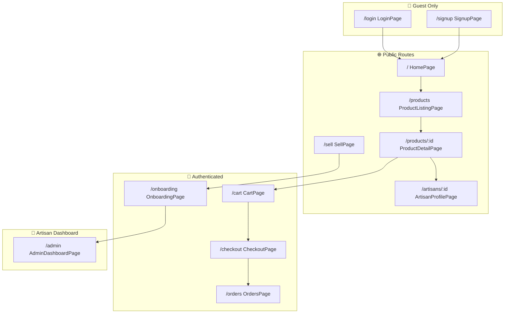

# KARU Marketplace

> A premium handicraft marketplace connecting artisans with conscious buyers. Available all over Bangladesh, not globally.

## Current Status
✅ **Wishlist Feature** - Heart icon on product cards, Save button, dedicated /wishlist page
✅ **Marketplace Polished** - All links, filters, and hero CTAs functional
✅ **Phase 8 Complete** - AI Chat Assistant (No-Cost Implementation)
✅ **Phase 7 Complete** - Industry-Grade Architecture (Schema Migration & Authorization)
✅ **Phase E Complete** - Checkout, Orders & Admin Dashboard
✅ **Phase D Complete** - Vercel Deployment & Environment Fix
✅ **Phase C Complete** - User Authentication & Cart
✅ **Phase B Complete** - Homepage Integration
✅ **Phase A Complete** - Page-to-Page Linking Fixed
✅ **Phase 6 Complete** - Convex Backend Integration

### Implementation Log
- [x] **Bug Fixes**
  - [x] Fixed "Become a Seller" link 404 error
- [x] **Phase 8: AI Experience**
  - [x] Floating Action Chat Button with animations
  - [x] "Mock AI" Logic for instant shipping/return answers
  - [x] Suggested Questions chips
  - [x] Zero-cost implementation (no external API deps)
- [x] **Image URL Support**
  - [x] Artisan avatar & cover URL inputs in onboarding
  - [x] Live image previews
  - [x] Product image URLs in Admin (already supported)
- [x] **Phase 7: Industry-Grade Architecture**
  - [x] Added `userProfiles` table linking users to roles and artisans
  - [x] Added `userId` field to artisans table for ownership
  - [x] Created `userProfiles.ts` with profile queries/mutations
  - [x] Secured `admin.ts` - artisanId derived from auth, not arguments
  - [x] Product CRUD verifies ownership before modification
  - [x] Created `UserMenu.tsx` component (Etsy-style dropdown)
  - [x] Updated `Header.tsx` with avatar dropdown and Shop Manager link
  - [x] Updated `AdminDashboardPage` to use auth-derived artisan
  - [x] Artisan onboarding flow (`/sell`, `/onboarding`)
- [x] **Checkout Flow & Orders**
  - [x] Checkout page with shipping address form
  - [x] Order creation and cart clearing
  - [x] Order confirmation page
  - [x] Order history page with expandable details
  - [x] Status badges (pending/processing/shipped/delivered)
- [x] **Admin Dashboard**
  - [x] Artisan selector for multi-artisan support
  - [x] Overview tab with sales stats
  - [x] Products tab with add/edit/delete
  - [x] Orders tab with status management
- [x] **Vercel Deployment**
  - [x] Configured `VITE_CONVEX_URL` in Vercel for production connectivity
  - [x] Updated `SITE_URL` in Convex for authentication redirects
- [x] React 19 + Vite + TypeScript setup
- [x] Tailwind CSS v3 with custom earth-tone theme
- [x] Google Fonts (Epilogue, Manrope, Noto Serif)
- [x] Header with logo, search, cart/wishlist icons, orders link
- [x] Footer with navigation columns and social links
- [x] Premium Hero section - 2-column layout with 4-image grid
- [x] Trending Now product grid with filter tabs
- [x] Shop by Category cards
- [x] Featured Artisan spotlight
- [x] React Router configuration
- [x] Product Detail Page with responsive gallery
- [x] Product Listing Page with comprehensive filters
- [x] Artisan Profile Page with biography and story
- [x] **Convex Backend Integration**
  - [x] Database schema (products, artisans, categories, users, cart, orders, userProfiles)
  - [x] Real-time queries and mutations
  - [x] Seed data (4 artisans, 12 products, 5 categories)
- [x] **All Pages Connected to Convex**
  - [x] ProductDetailPage, ArtisanProfilePage, TrendingSection
  - [x] FeaturedArtisan, CategorySection
- [x] **Wishlist/Favorites Feature**
  - [x] Added `wishlist` table to Convex schema
  - [x] Created `wishlist.ts` with CRUD operations (add, remove, toggle, check)
  - [x] Created reusable `WishlistButton` component
  - [x] Added heart icon on product cards and detail pages
  - [x] Header wishlist icon links to `/wishlist` with count badge
  - [x] Dedicated `/wishlist` page with empty/unauthenticated states
- [x] **Smart Search Functionality**
  - [x] Added `search_body` index to `products` table
  - [x] implemented `products:search` backend function
  - [x] Integrated search in Header and ProductListingPage
  - [x] Handled "no results" and clear search states
- [x] **Marketplace Connectivity & Fixes**
  - [x] Connected Hero section "Explore Marketplace" button to `/products`
  - [x] Added "Marketplace" link to Footer "Shop" column
  - [x] Fixed Trending Now filter tabs (New Arrivals, Best Sellers)
  - [x] Fixed Artisan Profile links from listing page
  - [x] Created placeholder pages for all footer links
- [x] **User Authentication & Cart**
  - [x] Convex Auth with Password provider
  - [x] HTTP actions enabled for auth
  - [x] JWT environment variables configured
  - [x] Login and Signup pages
  - [x] Cart page with quantity controls
  - [x] Auth-aware Header with cart count
  - [x] Add to Cart functionality

## Quick Start
```bash
npm install
npm run dev          # Start Vite dev server
npx convex dev      # Start Convex backend (in separate terminal)
```
Open http://localhost:5173

## Environment Variables
For production (Vercel), ensure the following are set:
- `VITE_CONVEX_URL`: Your Convex deployment URL (from `npx convex dev` or Convex dashboard).
- `SITE_URL`: (In Convex Dashboard) Your Vercel deployment URL (e.g., `https://karu-bd.vercel.app`).

## Tech Stack
- **Frontend**: React 19, TypeScript, Vite
- **Styling**: Tailwind CSS v3
- **Icons**: Lucide React
- **Routing**: React Router DOM
- **Backend**: Convex (real-time database)
- **Auth**: @convex-dev/auth

## Project Structure
```
src/
├── components/
│   ├── layout/         # Header, Footer, Layout, UserMenu
│   ├── home/           # Homepage sections
│   └── product/        # ProductCard, FilterSidebar, Gallery, Info
├── pages/              # Home, Products, ProductDetail, Artisan, Login, Signup, Cart, Checkout, Orders, Admin, Sell, Onboarding
└── router.tsx          # Route definitions
convex/
├── schema.ts           # Database schema + auth tables + userProfiles
├── auth.ts             # Convex Auth configuration
├── users.ts            # User and cart mutations
├── userProfiles.ts     # User profile queries (role, artisan linking)
├── products.ts         # Product queries
├── artisans.ts         # Artisan queries
├── categories.ts       # Category queries
├── orders.ts           # Order mutations and queries
└── admin.ts            # Secured artisan dashboard (RBAC)
```

## Routing Architecture

All routes are defined in [`src/router.tsx`](file:///y:/Antigravity%20workspace/Handicraft%20Marketplace/KARU/src/router.tsx) using React Router DOM v6.

### Route Map



### Route Table

| Route | Component | Access Level | Description |
|-------|-----------|--------------|-------------|
| `/` | `HomePage` | Public | Hero, trending products, categories, featured artisan |
| `/products` | `ProductListingPage` | Public | Filterable product grid with category/price/material filters |
| `/products/:id` | `ProductDetailPage` | Public | Product gallery, details, add-to-cart, artisan info |
| `/artisans` | `ArtisansPage` | Public | List of all artisans with cards |
| `/artisans/:id` | `ArtisanProfilePage` | Public | Artisan biography, story, studio, and product collection |
| `/sell` | `SellPage` | Public | "Sell on Karu" landing page with benefits and CTAs |
| `/login` | `LoginPage` | Guest | Email/password authentication |
| `/signup` | `SignupPage` | Guest | New user registration |
| `/cart` | `CartPage` | Authenticated | Shopping cart with quantity controls |
| `/checkout` | `CheckoutPage` | Authenticated | Shipping address form, order placement |
| `/orders` | `OrdersPage` | Authenticated | Order history with expandable details and status |
| `/onboarding` | `OnboardingPage` | Authenticated | 3-step artisan shop creation wizard |
| `/admin` | `AdminDashboardPage` | Artisan | Product CRUD, order management, sales stats |
| `/story`, `/gift-cards`, etc. | `PlaceholderPages` | Public | Footer links with "Coming Soon" placeholders |

### Navigation Flow

```
┌─────────────────────────────────────────────────────────────────┐
│                         HEADER (Global)                         │
│  Logo → Home | Search | Cart Badge | Orders Link | Auth Links   │
└─────────────────────────────────────────────────────────────────┘
                              │
        ┌─────────────────────┼─────────────────────┐
        ▼                     ▼                     ▼
   [Browse Flow]         [Auth Flow]          [Purchase Flow]
        │                     │                     │
   Home Page             Login/Signup           Cart Page
        │                     │                     │
   Product Listing       ──► Redirect ──►      Checkout
        │                     to Home               │
   Product Detail                              Order Confirm
        │                                          │
   Artisan Profile                             Orders Page
```

### Layout Wrapper

All routes use the shared `<Layout>` component which provides:
- **Header**: Logo, navigation, search, cart/wishlist icons, auth state
- **Footer**: Navigation columns, newsletter, social links
- **Consistent styling**: Earth-tone theme, responsive breakpoints

### Dynamic Route Parameters

| Parameter | Route | Usage |
|-----------|-------|-------|
| `:id` | `/products/:id` | Convex product `_id` (e.g., `jh7a...`) |
| `:id` | `/artisans/:id` | Convex artisan `_id` |

## Architecture: Phase 7 Implementation
*Completed: Jan 2026*

### Unified Identity System ✅
Users and Artisans are now linked through the `userProfiles` table:
- **userProfiles table**: Stores `userId`, `role` (user/artisan/admin), and optional `artisanId`
- **artisans table**: Now includes `userId` field linking back to the owner
- **Authorization**: All mutations verify ownership via `userProfiles` lookup

### Secure RBAC ✅
All admin mutations now derive `artisanId` from the authenticated user:
- `addProduct` - Creates product for logged-in artisan only
- `updateProduct` / `deleteProduct` - Verifies ownership before modification
- `updateOrderStatus` - Only artisan can update orders containing their products

### Etsy-Style Navigation ✅
The Header now supports role-based navigation:
- **Logged Out**: "Sign in" link
- **Logged In (Buyer)**: Avatar dropdown with "Orders", "Settings", "Sell on Karu"
- **Logged In (Artisan)**: Same dropdown but with "Shop Manager" quick-access button

### Self-Serve Artisan Onboarding ✅
Users can become artisans through a guided flow:
1. `/sell` - Landing page explaining benefits
2. `/onboarding` - 3-step wizard (Basics → Story → Details)
3. On completion, `registerArtisan` mutation creates artisan record and links to user

---

## Next Steps (Potential Enhancements)

- [x] Add image upload for artisan avatars and product photos (via image URL)
- [x] Implement smart search functionality 
- [x] Add wishlist/favorites feature
- [ ] fake Payment gateway integration showcase (bKash, Nagad)
- [ ] Reviews and ratings system
